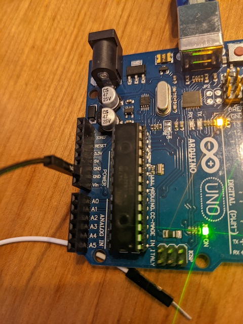
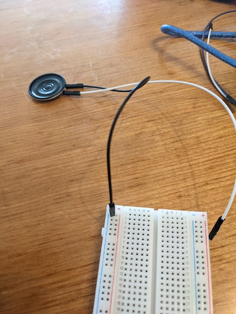
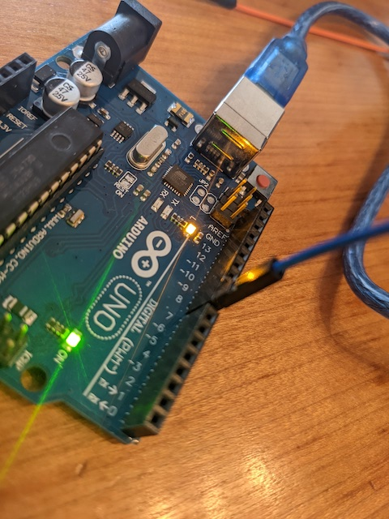

# clase-07

martes 26 abril 2022, presencial

## repaso clase anterior y programa hoy (10 min)

la clase pasada fue cancelada, pero la anterior aprendimos:

* botón pulsador
* delay() y maneras de evitarlo
* potenciómetro
* PWM

hoy aprenderemos:

* sonido
* diseño de sintetizadores
* protocolo MIDI

## sonido (45 min)

el sonido es una perturbación de la presión atmósferica, que nuestros oídos son capaces de escuchar.

usaremos nuestro microcontrolador Arduino para generar voltajes que pueden ser alimentados a un parlante, para así transducir energía eléctrica en mecánica y con esto generar sonido.

en este curso usaremos un parlante pequeño, típico en usos de proyectos de electrónica para principiantes como este [https://www.adafruit.com/product/1891]
(https://www.adafruit.com/product/1891).

en particular, usamos un parlante de 8 Ohm y de 0.25 W de potencia. les soldé cables cables de distintos colores para señalizar los terminales positivos y negativos.

esta es la vista frontal del parlante.

y esta es la vista trasera donde se ven sus especificaciones eléctricas.

para probar el funcionamiento de nuestro parlante, conectaremos el parlante a nuestro Arduino, primero a tierra. 

y después al pin 8 digital, en el lado derecho del Arduino.

para que se vea así.

subimos el código [ej_00_probar_parlante/](./ej_00_probar_parlante/) para probar el funcionamiento. este código solamente emite sonido durante setup(), no en loop().

para poder volver a escuchar el sonido, conectar y desconectar el cable USB, o presionar el botón rojo para reiniciar.

probemos cambiando la frecuencia, encontrar el menor y mayor número de frecuencia que podemos escuchar.

en el ejemplo [ej_01_melodia](./ej_01_melodia/) tenemos una melodía de 8 notas, usaremos 2 arreglos de tipo int y tamaño 8, uno para almacenar las frecuencias y otro para las duraciones.

los arreglos nos permiten almacenar conjuntos de valores relacionados, e iterar a través de ellos fácilmente, usando un bucle for.

## diseño de sintetizadores (45 min)

hasta el momento tenemos un instrumento muy difícil de manejar, que solamente podemos encender y apagar. agreguemos una interfaz electrónica para poder controlar diversos aspectos del sonido.

hoy construiremos nuestro primer sintetizador, que es un instrumento electrónico que permite sintetizar o crear sonidos.

primero traspasemos el circuito con nuestro parlante a nuestra protoboard, para así añadir más componentes.

partamos de nuestra protoboard anterior, con un botón pulsador en el extremo inferior.

conectemos la tierra del parlante a la protoboard.

conectemos la señal del parlante a la fila 1 de la protoboard.

usemos un cable para acceder a los 5v desde nuestro Arduino.

el otro extremo del cable se conecta al riel de alimentación de la protoboard.

usamos otro cable para acceder a tierra en Arduino.

y el otro extremo lo usamos para conectar al riel de tierra de la protoboard.

conectamos otro cable a la señal de salida de audio del Arduino.

conectamos el otro extremo del cable a la fila 1 de la protoboard, para conectar con el parlante.

el circuito del parlante se ve así, y si presionamos el botón rojo podemos escuchar de nuevo la melodía.

en un teclado, las teclas pueden ser pulsadas para indicar cuando un sonido empieza y cuando termina. para implementar esto usaremos nuestro pulsador.

## protocolo MIDI (60 min)

el protocolo MIDI fue creado en los 80.

incluir referencia a libro sobre protocolo MIDI y economía y ciencias sociales.

baud rate 115200

mensaje MIDI típico: 3 bytes.

donde 1xxxxxxx 0xxxxxxx 0xxxxxxx

el byte 0 empieza con 1.

los bytes 1 y 2 empiezan con 0

esto sirve para poder saber dónde empiezan y terminan los mensajes

esto hace que a pesar de usar bytes para enviar y recibir mensajes, su resolución es de 7 bits, no 8.

una resolución de 7 bits permite pow(2,7) = 128 valores distintos, resultando en rangos 0-127.

un típico mensaje de nota MIDI está hecho así:

donde 11001cccc 0nnnnnnn 0vvvvvvv

el byte 0 tiene en orden:
1 - por ser primer byte de mensaje MIDI
1001 - para indicar note on message
c = canal (0-15)

los siguientes byte empiezan con 0
n = número de nota (0-127)
v = velocidad o volumen(0-127)